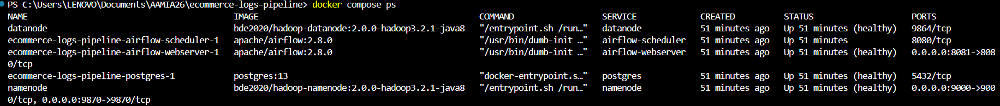
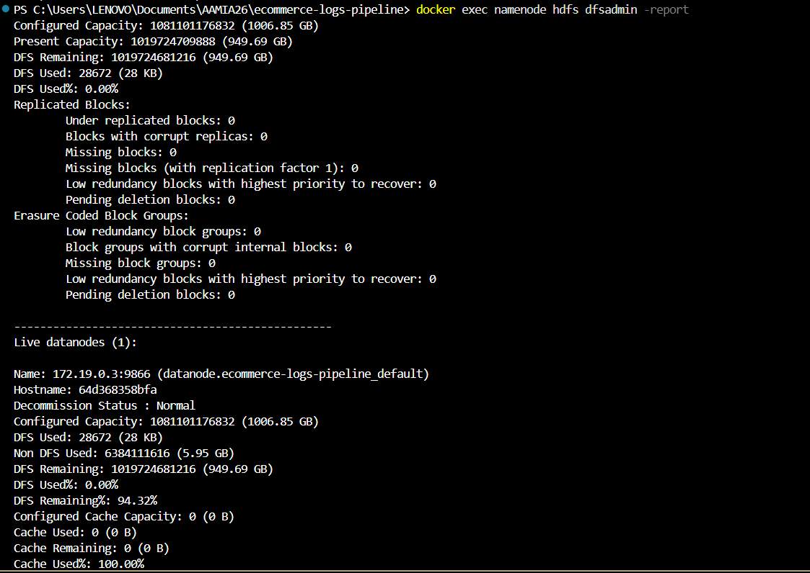
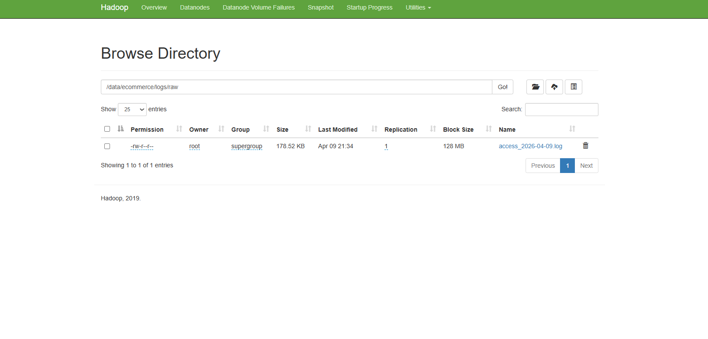
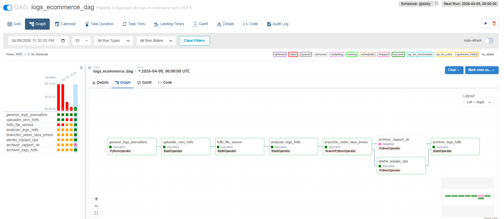
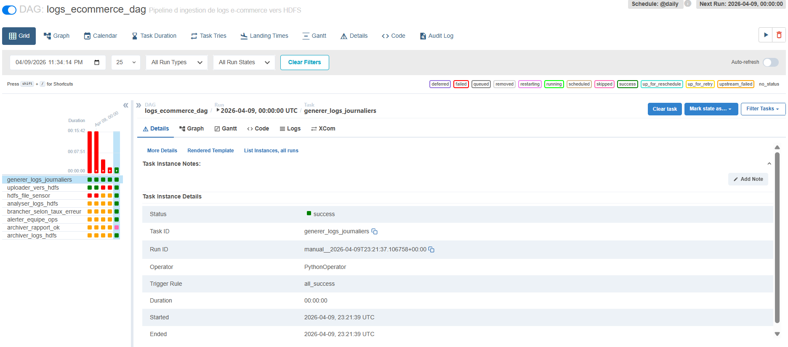
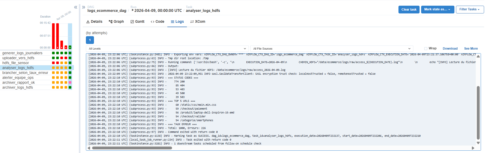
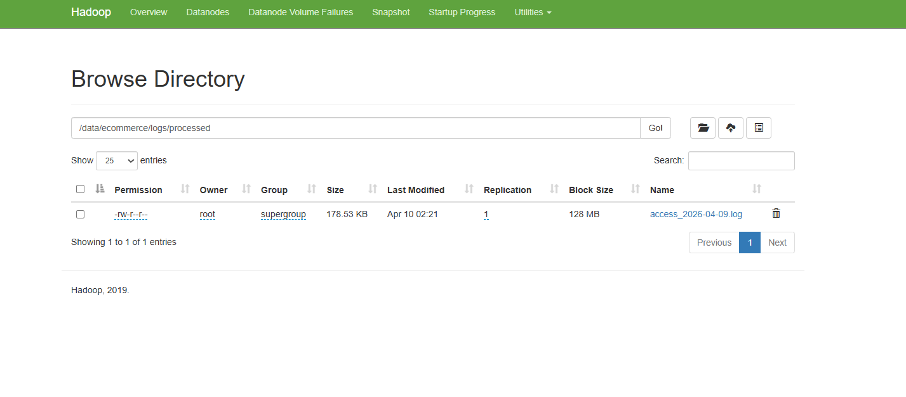

# Réponses aux questions du TP Jour 2

## Q1 — HDFS vs système de fichiers local

Distribution et scalabilité horizontale

Avec 50 Go/jour, le stockage local d'un seul serveur serait rapidement saturé (ex: 15 To par an)

HDFS permet d'ajouter des DataNodes supplémentaires pour augmenter la capacité de stockage linéairement

Les données sont réparties automatiquement sur plusieurs nœuds

Réplication et tolérance aux pannes

En production, le facteur de réplication est typiquement 3 : chaque bloc de données existe sur 3 DataNodes différents

Si un DataNode tombe, les données restent accessibles via les autres réplicas

Un système de fichiers local ou NFS représente un single point of failure

Localité des données (Data Locality)

HDFS rapproche le calcul des données (ex: avec Spark ou MapReduce)

Au lieu de déplacer les 50 Go de logs vers le moteur de calcul, on déplace le calcul vers les nœuds qui contiennent les données

Réduction drastique de la bande passante réseau et amélioration des performances

## Q2 — NameNode, point de défaillance unique (SPOF)

Les DataNodes continuent de fonctionner entre eux mais deviennent inaccessibles aux clients

Plus aucune opération de lecture/écriture n'est possible

Le cluster HDFS est en pratique indisponible

Mécanismes pour pallier ce problème : HDFS NameNode HA (High Availability)

Hadoop propose deux architectures :

NFS-based HA (moins courant)

Utilise un NFS partagé pour les journaux d'édition (edit logs)

Quorum-based HA (recommandé en production)

Deux NameNodes : Active (traite les requêtes) et Standby (en attente)

Les deux lisent/écrivent les edit logs sur un ensemble de JournalNodes (minimum 3)

Rôle du JournalNode :

Service qui maintient un quorum (majorité) pour les journaux d'édition

Garantit la cohérence entre Active et Standby NameNode

En cas de basculement, le Standby a exactement la même métadonnée que l'Active

Nécessite un nombre impair (3, 5, 7...) pour fonctionner correctement

## Q3 — HdfsSensor vs polling actif

Mode poke vs mode reschedule

Mode	Comportement	Impact workers
poke	Le sensor reste sur un worker et vérifie périodiquement	Occupe un slot worker pendant toute la durée
reschedule	Libère le worker entre deux vérifications	N'occupe un worker que pendant la vérification
Utilisation recommandée :

poke : DAG avec peu de sensors, durée courte (< 1 min), worker pool large

reschedule : Production avec CeleryExecutor, sensors longs (plusieurs heures)

Scénario où le mauvais choix bloque tout le scheduler :

Imaginez 50 DAGs chacun avec un mode="poke" qui attend 10 minutes un fichier. Chaque sensor occupe un worker. Si vous avez seulement 32 workers, après 32 sensors actifs, plus aucun worker disponible pour exécuter les autres tâches (upload, analyse, etc.). Le scheduler est bloqué.

Avec mode="reschedule", les sensors libèrent les workers entre les vérifications, permettant à d'autres tâches de s'exécuter.

## Q4 — Réplication HDFS et cohérence des données

Facteur de réplication = 3, écriture d'un bloc de 128 Mo :

Ordre d'écriture :

Client écrit le bloc sur le DataNode primaire (le plus proche)

DataNode primaire réplique le bloc sur un second DataNode (dans un autre rack si configuré)

Second DataNode réplique sur un troisième DataNode

Le client reçoit un accusé de réception

Nombre de copies : 3 copies sur 3 DataNodes différents

Cohérence lors d'une lecture concurrente :

HDFS garantit un modèle de cohérence write-once-read-many :

Une fois le bloc écrit et finalisé (dossier _COPYING_ supprimé), toutes les lectures voient la même donnée

Pas de lecture pendant l'écriture : si un client tente de lire un fichier en cours d'écriture, le comportement est indéfini

La méthode hflush() force la persistance des données et les rend visibles aux nouveaux lecteurs

Pour les mises à jour : HDFS ne supporte pas les modifications en place. La seule façon de "modifier" est de supprimer et recréer le fichier (atomicité garantie par le NameNode).

## Captures d'écran

1. 
2. 
3. 
4. 
5. 
6. 
7. 